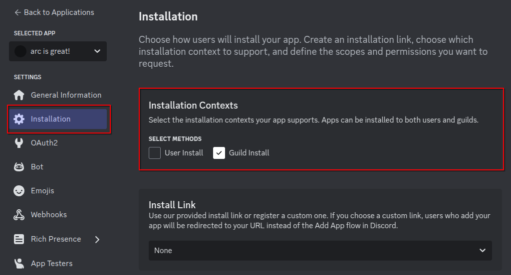
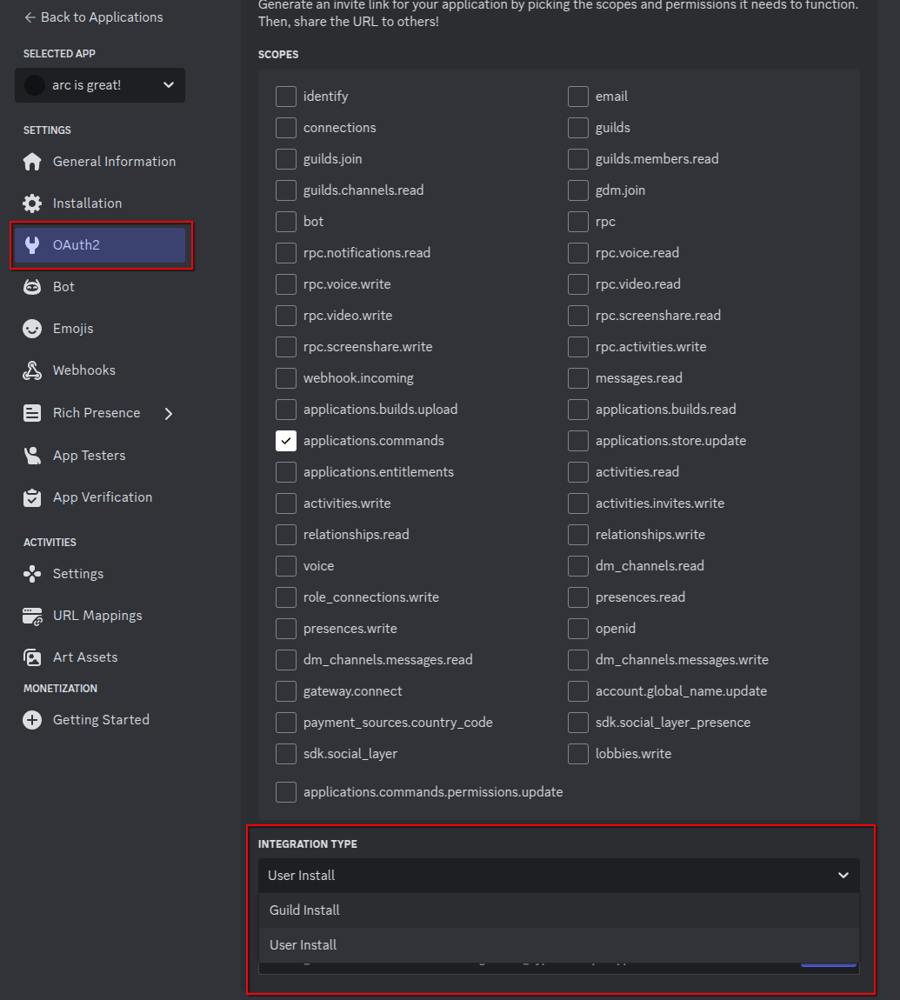

# Installation & Invocation Contexts

An app's installation context defines how it's installed: to a guild, to a user, or both.

The installation context affects how your app can be seen and used within Discord. For example, apps installed only to a user can't take actions in a guild, and apps installed only to a guild can't be accessed on other guilds of a user, or in group DMs.

## Guild Installs

Apps installed in a guild context (guild-installed apps) must be authorized by a guild member with the `MANAGE_GUILD` permission. Guild-installed apps are visible to all members of the guild, but other factors (like command permissions) determine where and when specific members can interact with the app.

This is the default experience `arc` provides, and is the most common way to install apps.

## User Installs

Apps installed in a user context (user-installed apps) are visible only to the authorizing user, and therefore don't require any guild-specific permissions.

Apps that support the user installation context are visible across all of an authorizing user's guilds, DMs, and GDMs, **but are forced to respect the user's permissions** in the surface where the app is being used. For example, if a user invokes a command for a user-installed app from a guild's channel where they don't have permission to send messages, the app won't be able to respond to an interaction with a non-ephemeral message.

## Configuring Installation Contexts

By default, your app can only be installed in guilds. To enable user installations, you first need to toggle it on in the Discord Developer Portal.

<figure markdown>
  { width="600" }
  <figcaption>Enabling Installation Contexts</figcaption>
</figure>

Then, you can create invites for both user and guild installations in the OAuth2 section of the Discord Developer Portal.

<figure markdown>
  { width="450" }
  <figcaption></figcaption>
</figure>

Once that's done, you can set the `integration_types` parameter on commands, command groups, plugins, and the client to specify where commands can be installed.

To enable both installation types for all commands, see the following snippet:

=== "Gateway"

    ```py
    client = arc.GatewayClient(
        bot,
        integration_types=[
            hikari.ApplicationIntegrationType.GUILD_INSTALL,
            hikari.ApplicationIntegrationType.USER_INSTALL
        ]
    )
    ```

=== "REST"

    ```py
    client = arc.RESTClient(
        bot,
        integration_types=[
            hikari.ApplicationIntegrationType.GUILD_INSTALL,
            hikari.ApplicationIntegrationType.USER_INSTALL
        ]
    )
    ```

To alter installations for a specific command, see the following snippet:

=== "Gateway"

    ```py
    # Only allow this command to be installed to users
    @arc.slash_command(
        "my_command",
        "My command description",
        integration_types=[hikari.ApplicationIntegrationType.USER_INSTALL],
    )
    async def my_command(ctx: arc.GatewayContext) -> None:
        ...
    ```

=== "REST"

    ```py
    # Only allow this command to be installed to users
    @arc.slash_command(
        "my_command",
        "My command description",
        integration_types=[hikari.ApplicationIntegrationType.USER_INSTALL]
    )
    async def my_command(ctx: arc.RESTContext) -> None:
        ...
    ```

## Invocation Context Types

On top of installation contexts, you can also customize where a command can be invoked. This is controlled via the `invocation_contexts` parameter on commands, command groups, plugins, and the client.

For instance, to create a command that can only be invoked in a guild, and only installable by users, see the following snippet:

=== "Gateway"

    ```py
    @arc.slash_command(
        "my_command",
        "My command description",
        invocation_contexts=[hikari.ApplicationContextType.GUILD],
        integration_types=[hikari.ApplicationIntegrationType.USER_INSTALL]
    )
    async def my_command(ctx: arc.GatewayContext) -> None:
        ...
    ```

=== "REST"

    ```py
    @arc.slash_command(
        "my_command",
        "My command description",
        invocation_contexts=[hikari.ApplicationContextType.GUILD],
        integration_types=[hikari.ApplicationIntegrationType.USER_INSTALL]
    )
    async def my_command(ctx: arc.RESTContext) -> None:
        ...
    ```

!!! tip
    Both parameters are inherited from the parent group, plugin or client. This means that if you set the `invocation_contexts` parameter on the client, all commands, command groups, and plugins will inherit
    the same value unless overridden at the plugin or command level. This can help reduce code duplication and ensure consistency across your bot.

## Querying Installation & Invocation Contexts at Runtime

To figure out how your command was installed and where it was invoked, you can use the `invocation_context` and `authorizing_integration_owners` properties on the `Context` object.

=== "Gateway"

    ```py
    @arc.slash_command(
        "install_details",
        "Check command installation details",
        integration_types=[
            hikari.ApplicationIntegrationType.USER_INSTALL,
            hikari.ApplicationIntegrationType.GUILD_INSTALL,
        ],
    )
    async def my_command(ctx: arc.GatewayContext) -> None:
        # Figure out where the command was invoked
        match ctx.invocation_context:
            case hikari.ApplicationContextType.GUILD:
                await ctx.respond("Hello from a guild!")
            case hikari.ApplicationContextType.BOT_DM:
                await ctx.respond("Hello from a DM!")
            case hikari.ApplicationContextType.PRIVATE_CHANNEL:
                await ctx.respond("Hello from a group DM!")

        # Figure out how the command was installed
        await ctx.respond(
            f"User who installed me: {ctx.authorizing_user_id or 'Not installed by user'}\n"
            f"Guild who installed me: {ctx.authorizing_guild_id or 'Not installed in guild'}"
        )
    ```

=== "REST"

    ```py
    @arc.slash_command(
        "install_details",
        "Check command installation details",
        integration_types=[
            hikari.ApplicationIntegrationType.USER_INSTALL,
            hikari.ApplicationIntegrationType.GUILD_INSTALL,
        ],
    )
    async def my_command(ctx: arc.RESTContext) -> None:
        # Figure out where the command was invoked
        match ctx.invocation_context:
            case hikari.ApplicationContextType.GUILD:
                await ctx.respond("Hello from a guild!")
            case hikari.ApplicationContextType.BOT_DM:
                await ctx.respond("Hello from a DM!")
            case hikari.ApplicationContextType.PRIVATE_CHANNEL:
                await ctx.respond("Hello from a group DM!")

        # Figure out how the command was installed
        await ctx.respond(
            f"User who installed me: {ctx.authorizing_user_id or 'Not installed by user'}\n"
            f"Guild who installed me: {ctx.authorizing_guild_id or 'Not installed in guild'}"
        )
    ```
