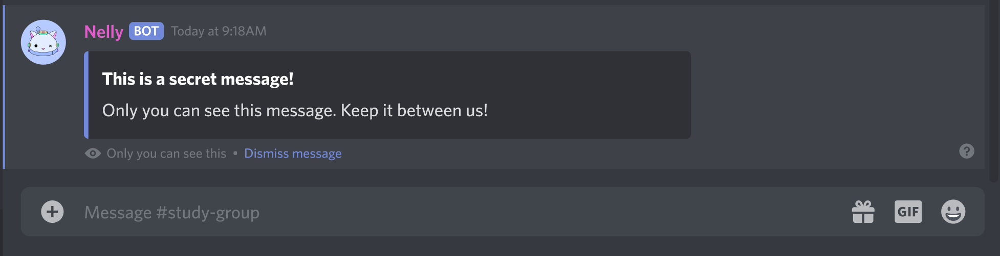

# Interactions

!!! info "Disclaimer"
    This is a simplified, non-technical explanation of how interactions work. If you want a more in-depth technical look, please check out the [Discord API Documentation](https://discord.com/developers/docs/interactions/receiving-and-responding#interactions-and-bot-users) instead.


## What is an "interaction" anyway?

Before interactions, there was only one way to make a bot communicate with users on Discord. You could listen to [events](./events.md) through the gateway, and if you so chose, respond to them. However this wasn't ideal, since for example, if you wanted to create a bot that listens for messages that start with `!` (as a common bot-prefix), you would have to scan every single message that is sent, just to find the ones that were meant for your bot. This also created issues with multiple bots potentially sharing the same common prefix, along with privacy concerns, since bots had the right (and practically the requirement) to read every single message.

**Interactions** were devised as a sort of "targeted event" by Discord to specifically prompt a bot to respond to user action. Instead of the bot having to listen to every single event through the gateway, it is simply "called to action" by Discord when the bot is requested to perform a specific action. These actions include:

- **App Commands** (Slash, Context Menu)
- **Slash Command Autocompletion**
- **Message Components** (Buttons, Selects)
- **Modals**

Whenever a user enters a slash command, or presses a button, Discord sends an interaction specifically to *your bot*, asking it to respond to the interaction.

## Interaction Response Flow

<figure markdown>
  { width="800" .no-lightbox }
  { width="800" .no-lightbox }
  <figcaption>The interaction response flow</figcaption>
</figure>

### Initial Response

!!! danger
    When your bot receives an interaction, it **must** issue an initial response to it **within 3 seconds**, or the interaction will be invalidated by Discord, and all further attempts to respond to it will fail with `404 Unknown interaction`.

Interactions must be acknowledged in some form by your bot, or they will fail. There's several response types, depending on the type of interaction:

- `MESSAGE_CREATE` - Send a message in response, this is what `arc` does when you call [`Context.respond()`][arc.context.base.Context.respond].

- `DEFERRED_MESSAGE_CREATE` - Signal to Discord that you are not quite ready to send a message yet, but will be in the future. This is what `arc` does when you call [`Context.defer()`][arc.context.base.Context.defer]. The user will see a loading state until you send a [followup](#followups).

- `MODAL` - Send a modal in response. [Modals](https://discord.com/developers/docs/interactions/message-components#text-inputs) are a type of interactive form that allows users to enter long-form text and send it to the bot. This corresponds to `arc`'s [`Context.respond_with_modal()`][arc.context.base.Context.respond_with_modal].

- `MESSAGE_UPDATE` - Update the message belonging to this interaction. **This is not a valid response for command interactions**.

- `DEFERRED_MESSAGE_UPDATE` - Signal to Discord that you intend to update the message belonging to this interaction, but you're not quite ready yet, but will be in the future. **This is not a valid response for command interactions**.

### Followups

Once you issued your initial response, be it a defer or an actual message, Discord will give you an additional **15 minutes** to create followup responses to the interaction. This includes sending new messages or editing/deleting existing responses. After 15 minutes, the interaction is permanently invalidated by Discord.

In `arc`, a followup is simply created by calling [`Context.respond()`][arc.context.base.Context.respond] again, `arc` automatically determines if you need to issue an initial response or a followup.

## Ephemeral messages

A benefit of using interactions is that they allow for sending **ephemeral responses**. An [ephemeral message](https://support.discord.com/hc/en-us/articles/1500000580222-Ephemeral-Messages-FAQ) is a message with a special flag, that can only be seen by the user who received it, and the bot who sent it.

<figure markdown>
  { width="800" }
  <figcaption>An example ephemeral message</figcaption>
</figure>

To create an ephemeral response, pass the `hikari.MessageFlag.EPHEMERAL` message flag to [`Context.respond()`][arc.context.base.Context.respond], similarly to this:

```py
await context.respond("I'm secret!", flags=hikari.MessageFlag.EPHEMERAL)
```

!!! note
    The ephemeral flag has to be present in the **initial response** to an interaction, **even if it is a defer**. This will automatically mark subsequent followups as ephemeral too. There is currently no way to mix ephemeral and non-ephemeral responses in a single interaction.

    This also means that ephemeral messages can **only** be sent as a response to an interaction.

## Autodefer

`arc` has a built-in feature to automatically defer interactions that are about to time out, to prevent the interaction from failing.

=== "Gateway"

    ```py hl_lines="9"
    import arc
    import asyncio

    # ... Snip

    @client.include
    @arc.slash_command("name", "description")
    async def takes_time(context: arc.GatewayContext) -> None:
        await asyncio.sleep(10) # Simulate something taking a long time
        await context.respond("Finished!")
    ```

=== "REST"

    ```py hl_lines="9"
    import arc
    import asyncio

    # ... Snip

    @client.include
    @arc.slash_command("name", "description")
    async def takes_time(context: arc.RESTContext) -> None:
        await asyncio.sleep(10) # Simulate something taking a long time
        await context.respond("Finished!")
    ```

You'd expect the interaction in the above command to time out after 3 seconds, and the call to [`Context.respond()`][arc.context.base.Context.respond] to fail, however `arc`, by default, after 2 seconds of not providing an initial response, defers the interaction for you to keep the interaction alive, thus the command succeeds. This default behaviour may however be undesirable if you want to, for example, make the initial response be ephemeral, or have tighter control over how the initial response is created. For this reason, `arc` provides 3 seperate configurations for autodeferring through the [`AutodeferMode`][arc.context.base.AutodeferMode] enum.

- `AutodeferMode.OFF` - Autodeferring is completely turned off. If you fail to respond within 3 seconds, the interaction fails.
- `AutodeferMode.ON` (Default) - The interaction will be deferred after 2 seconds if you did not create an initial response by then. **The defer will not be ephemeral**.
- `AutodeferMode.EPHEMERAL` - The interaction will be deferred after 2 seconds if you did not create an initial response by then. **The defer will be ephemeral**.

This can be passed to the command decorator's `autodefer=` keyword argument:

=== "Gateway"

    ```py hl_lines="7"
    import arc
    import asyncio

    # ... Snip

    @client.include
    @arc.slash_command("name", "description", autodefer=AutodeferMode.EPHEMERAL)
    async def takes_time(context: arc.GatewayContext) -> None:
        await asyncio.sleep(10)
        await context.respond("Finished!") # This will now be an ephemeral response!
    ```

=== "REST"

    ```py hl_lines="7"
    import arc
    import asyncio

    # ... Snip

    @client.include
    @arc.slash_command("name", "description", autodefer=AutodeferMode.EPHEMERAL)
    async def takes_time(context: arc.RESTContext) -> None:
        await asyncio.sleep(10)
        await context.respond("Finished!") # This will now be an ephemeral response!
    ```

The `autodefer=` argument can be passed to commands command groups, plugins, and the client. If you do not specify the setting for a given object, the setting will be inherited from the parent.
