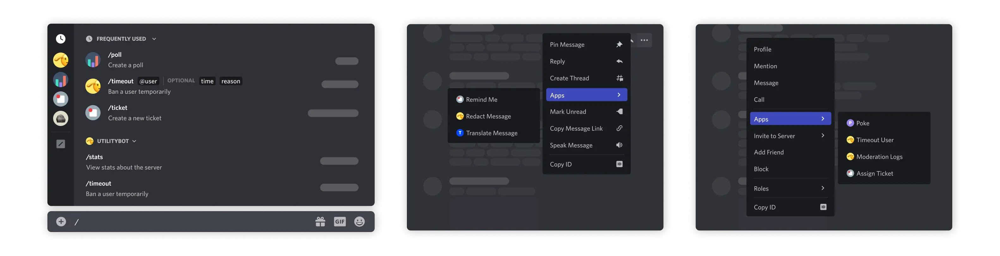

# Home

<figure markdown>
  { width="90%" .no-lightbox }
  { width="90%" .no-lightbox }
  <figcaption></figcaption>
</figure>

<figure markdown>
  { .no-lightbox }
  <figcaption></figcaption>
</figure>

Welcome to the documentation for `hikari-arc`, an extensible command handler built on [`hikari`](https://github.com/hikari-py/hikari) with a focus on type-safety & correctness, making the creation of commands on Discord easy!

- [:octicons-arrow-right-24: Get Started](./getting_started.md)
- [:octicons-book-24: Guides](./guides/index.md)

## Helpful Resources

- [**GitHub**](https://github.com/hypergonial/hikari-arc)
- [**Examples**](https://github.com/hypergonial/hikari-arc/tree/main/examples)
- [**Hikari Documentation**](https://docs.hikari-py.dev/en/stable/)
- [**Hikari Discord**](https://discord.gg/hikari)
- [**Discord Developer Documentation**](https://discord.com/developers/docs/intro)

### Acknowledgements

The `arc` logo was made by [@PythonTryHard](https://github.com/PythonTryHard).

Some illustrations used in this documentation are from the [Discord Developer Documentation](https://discord.com/developers/docs/intro).
